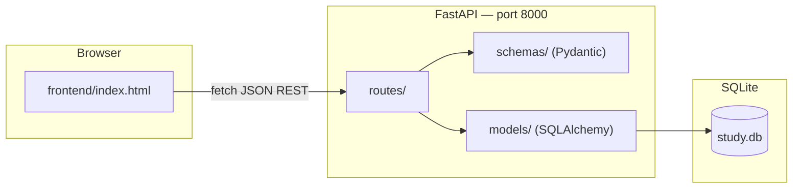
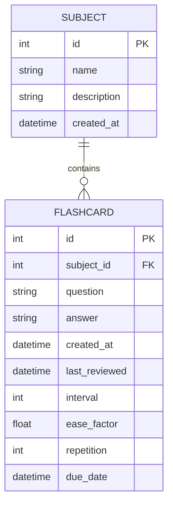

# Purrfect Recall (AnkiLikeWeb)

**Purrfect Recall** is the working name for this spaced-repetition flashcard app (repo: `AnkiLikeWeb`). Manage **subjects** (decks), create **flashcards**, and review them with an SM-2 scheduling algorithm.

The project is an MVP: a FastAPI backend with SQLite persistence and a vanilla HTML/CSS/JS frontend that talks to the API over HTTP.

## Architecture



### Request flow (study session)

1. User selects a deck and clicks **Start Study** in the frontend.
2. Frontend loads flashcards via `GET /flashcards?subject_id=…`, preferring cards whose `due_date` is in the past.
3. User reveals the answer and submits a confidence rating (0–100%).
4. Frontend maps confidence to an SM-2 **quality** score (0–5) and calls `POST /flashcards/{id}/review`.
5. Backend updates `interval`, `ease_factor`, `repetition`, `last_reviewed`, and `due_date`, then returns the updated card.

## Tech stack

| Layer | Technology |
|-------|------------|
| Backend | Python 3.13+, FastAPI, Uvicorn |
| ORM | SQLAlchemy 2.x |
| Validation | Pydantic v2 |
| Database | SQLite (`study.db` at repo root) |
| Frontend | Static HTML, CSS, inline JavaScript |
| Package manager | [uv](https://docs.astral.sh/uv/) |

## Bundled starter decks

Eight default decks ship in `bundled_decks/decks.json` and are **inserted automatically** when the API starts (by deck name — existing decks are left untouched):

| Deck | Cards | Notes |
|------|------:|-------|
| Spanish Essentials | 10 | Basic vocabulary |
| World Capitals | 10 | Country → capital |
| CS Fundamentals | 10 | Developer concepts |
| Periodic Table | 10 | Symbol → element name |
| Sci-Fi Classics | 10 | Landmark sci-fi films |
| Sci-Fi Worlds | 10 | Ships, characters, tech |
| Horror Legends | 10 | Classic horror trivia |
| Horror Creatures | 10 | Monster → film |

Fresh install: start the API once (`./scripts/dev.sh` or `uv run uvicorn app.main:app --reload`) and the decks appear in the native apps and web UI.

## Project structure

```
AnkiLikeWeb/
├── app/
│   ├── main.py              # FastAPI app, CORS, router registration
│   ├── database.py          # Engine, SessionLocal, get_db dependency
│   ├── models/              # SQLAlchemy ORM models
│   │   ├── subject.py
│   │   └── flashcard.py
│   ├── schemas/             # Pydantic request/response models
│   │   ├── subject.py
│   │   └── flashcard.py
│   └── routes/              # API route handlers
│       ├── subjects.py
│       └── flashcards.py
├── frontend/
│   ├── index.html           # Legacy browser UI (dev/testing)
│   └── styles.css
├── apps/
│   ├── PurrfectRecall.xcodeproj   # Native macOS + iOS apps
│   ├── PurrfectRecallKit/         # Shared SwiftUI library
│   ├── PurrfectRecallMac/
│   └── PurrfectRecallIOS/
├── docs/
│   ├── sm2-scheduling.md      # SM-2 algorithm and confidence slider mapping
│   └── native-apps.md         # Native app architecture and build steps
├── scripts/
│   ├── dev.sh                     # Start backend + frontend together
│   └── add_flashcard_columns.py   # One-off SQLite migration helper
├── app_scheme_images/       # Architecture diagrams (reference / future plans)
├── study.db                 # SQLite database (created at runtime)
├── pyproject.toml
└── main.py                  # Placeholder entrypoint (use uvicorn instead)
```

## Getting started

### Prerequisites

- Python 3.13+
- [uv](https://docs.astral.sh/uv/) (recommended) or pip

### Install dependencies

```bash
uv sync
```

### Run everything (recommended)

```bash
./scripts/dev.sh
```

Starts the API on `http://127.0.0.1:8000` and the frontend on `http://127.0.0.1:5500`. Press Ctrl+C to stop both.

### Makefile (native apps)

```bash
make build          # API deps + PurrfectRecallMac debug build
make start          # API in background + launch Mac app
make rebuild        # reinstall deps, rebuild Mac app, restart
make build-ios      # API deps + iOS simulator build
make start-ios      # API + install/launch on booted simulator
make stop           # stop API
make dev-api        # API foreground with --reload
make dev-web        # legacy browser UI + API (port 5500)
make release-macos  # Release .app → dist/
```

Optional environment overrides:

```bash
STUDYWEB_HOST=127.0.0.1 STUDYWEB_API_PORT=8000 STUDYWEB_FRONTEND_PORT=5500 ./scripts/dev.sh
```

### Run services separately

**API server**

```bash
uv run uvicorn app.main:app --reload
```

The API is available at `http://127.0.0.1:8000`. Interactive docs: `http://127.0.0.1:8000/docs`.

Tables are created automatically on startup via `Base.metadata.create_all()`.

**Frontend**

The frontend is **not** served by FastAPI. Open it with any static file server, for example:

```bash
cd frontend && python -m http.server 5500
```

Then open `http://127.0.0.1:5500` in your browser. The frontend expects the API at `http://127.0.0.1:8000` (see `API` constant in `frontend/index.html`).

### Native apps (macOS + iOS)

See **[`docs/native-apps.md`](docs/native-apps.md)** for the full guide. Quick start:

```bash
./scripts/dev.sh          # API on :8000
cd apps && open PurrfectRecall.xcodeproj
# Run scheme PurrfectRecallMac or PurrfectRecallIOS
```

The native clients implement the BlackCat Audio redesign from `design_handoff_flashcard_app_ui/`.

### Database migrations

For existing databases created before spaced-repetition columns were added, run:

```bash
uv run python scripts/add_flashcard_columns.py
uv run python scripts/add_review_table.py
```

## API reference

### Subjects (`/subjects`)

| Method | Path | Description |
|--------|------|-------------|
| `GET` | `/subjects` | List all subjects |
| `POST` | `/subjects` | Create subject `{ name, description? }` |
| `PUT` | `/subjects/{id}` | Update subject |
| `DELETE` | `/subjects/{id}` | Delete subject and its flashcards (cascade) |

### Flashcards (`/flashcards`)

| Method | Path | Description |
|--------|------|-------------|
| `GET` | `/flashcards` | List cards; optional `?subject_id=` filter |
| `GET` | `/flashcards/due` | Cards with `due_date <= now` |
| `GET` | `/flashcards/{id}` | Get one card |
| `POST` | `/flashcards` | Create card (see media fields below) |
| `PUT` | `/flashcards/{id}` | Partial update |
| `DELETE` | `/flashcards/{id}` | Delete card |
| `GET` | `/flashcards/study-queue` | Prioritized queue; `?subject_id=&limit=50` |
| `POST` | `/flashcards/{id}/review` | FSRS review → `{ card, predicted_recall_before_pct, … }` |

Optional flashcard media fields: `example`, `ipa`, `image_path`, `audio_word`, `audio_meaning`, `audio_example`. See `docs/media-cards.md`.

### Media (`/media`)

| Method | Path | Description |
|--------|------|-------------|
| `GET` | `/media/{path}` | Serve file from repo `media/` directory |
| `POST` | `/media/upload` | Upload image/audio; returns `{ path, url }` |

Run `uv run python scripts/add_flashcard_media_columns.py` on existing databases before using media fields.

### Stats (`/stats`)

| Method | Path | Description |
|--------|------|-------------|
| `GET` | `/stats` | Aggregated stats + `recommended_daily_reviews` |
| `GET` | `/stats/calibration` | Confidence calibration hints; `?subject_id=` |

Run `uv run python scripts/add_review_table.py` on existing databases so review history is logged for stats.

### Health check

| Method | Path | Description |
|--------|------|-------------|
| `GET` | `/` | `{ "status": "ok" }` |

## Data model



### SM-2 scheduling

Purrfect Recall uses **FSRS** for scheduling (see `docs/fsrs-scheduling.md`). Each card tracks FSRS memory fields plus legacy `interval`, `repetition`, `ease_factor`, and `due_date`. Reviews return **predicted recall %** from the model.

The Study UI uses a **confidence slider** (0–100%) mapped to SM-2 quality instead of Anki’s four buttons — same scheduler, smoother UX. This mapping is designed so a future **FSRS** backend can replace SM-2 without changing the UI.

**Full specification:** [`docs/sm2-scheduling.md`](docs/sm2-scheduling.md)

Quick summary:

- **quality &lt; 3** — reset `repetition` to 0, `interval` to 1 day
- **quality ≥ 3** — increment `repetition`; intervals: 1 day → 6 days → `interval × ease_factor`
- **Ease factor** — updated after every review via the SM-2 formula (min 1.3)
- **due_date** — `now + interval` days

| Confidence | SM-2 quality |
|------------|-------------:|
| 0–20% | 0 |
| 20–40% | 2 |
| 40–60% | 3 |
| 60–80% | 4 |
| 80–100% | 5 |

## Frontend views

| View | Purpose |
|------|---------|
| **Home** | Landing page |
| **Study** | Due-card review session with confidence slider |
| **My Decks** | CRUD for subjects and flashcards |
| **Stats** | Placeholder (not implemented) |
| **Login / Register** | Client-side only; no backend auth yet |

**Native apps (macOS/iOS)** in `apps/` implement the full redesign: Dashboard, Study, Decks (search + master/detail), and Stats. See `docs/native-apps.md`.

## Development notes

- CORS is open (`allow_origins=["*"]`) for local development.
- Debug `print()` statements remain in `app/main.py` and `app/routes/subjects.py`.
- `app_scheme_images/` contains aspirational architecture diagrams (React frontend, FSRS, auth, Alembic migrations) — not the current implementation.
- See `app/ToDoList.txt` for known follow-ups.

## Roadmap (planned)

- User authentication (`/auth/login`, `/auth/register`)
- Stats dashboard — **implemented in native apps**; web UI still a stub
- Proper migrations (Alembic)
- Frontend refactor (component-based SPA or framework) — **superseded by native apps for primary UX**
- Optional FSRS algorithm alongside or replacing SM-2

## License

Not specified.
